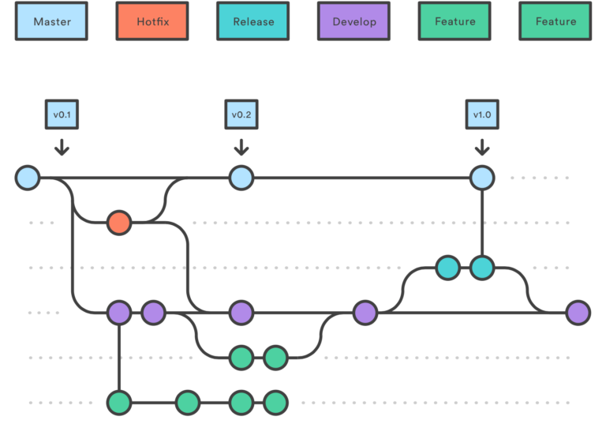

Introduction to Git Flow
===============================================

# Git workflows

There are several ways to use Git branches (we talk about **workflows**).

-   *Centralized workflow*: one main branch, everyone commit in the same
    place. 
-   *Feature Branch Workflow*: developments are made in dedicated
    branches (feature branches), which are regularly merged into the
    master one.
-   ***Gitflow Workflow***: Strict branching model designed around the
    project release.

Source: <https://www.atlassian.com/git/tutorials/comparing-workflows>

# GitFlow branches

GitFlow workflow contains two main branches:
-   `master`: official release history. Branch which is shared to the
    world!
-   `develop`: integration branch for features

It also contains additional temporal branches:
-   `feature`: feature branches (one for each new feature to add to the
    code)
-   `release`: branch created when enough features have been added (new
    version of the code) to develop
-   `hotfix`: branch for maintenance and bug correction of the
    production release
    
 <div align="center">
    
 </div>
 
 Source: https://blog.engineering.publicissapient.fr/2018/03/28/gitflow-est-il-le-workflow-dont-jai-besoin/
 
 # Using `git flow` extension
 
 It is possible to use the `git flow` workflow using standard git commands (`merge`, `checkout`, `rebase`, etc.). **However, it is strongly recommended to use the `git flow` extension**. 
 
 It can be installed following the [Installation page](https://github.com/nvie/gitflow/wiki/Installation). On Linux, type:

```
sudo apt-get install git-flow
```

 A full list of `git flow` command is available [here](https://github.com/nvie/gitflow/wiki/Command-Line-Arguments)

# Initialisation

To activate the `git flow` tool, go in your repository and type: 

```
git flow init
```

Then press `Enter` until the end of the initialisation process to keep the standard names. You will be automatically moved to the `develop` branch.

# Feature branches

Commands related to `feature` branches are listed below:
- `git flow feature` list all the feature branches that exist
- `git flow feature start feature_name` creates a **local** feature branch from `develop`
- `git flow feature checkout feature_name` allows to swith to another feature branch
- `git flow feature publish` pushed the local feature branch to the remote repository and connect it with the local one.
- `git flow feature track feature_name` pulls a remote feature branch
- `git flow feature pull` updates the local branch from the remote branch
- `git flow feature finish` finishes the current feature branch. It deletes the branch **locally, not remotely**, and merges it into `develop`
- `git flow feature rebase` rebases the current feature branch with `develop`.

Notes: 
- to delete the eventual **remote** branch with a call to `finish`, add the `-F` option. Or type: `git push origin :feature/feature_name`. 
- after a `finish`, push the `develop` branch to the remote repository using `git push`
- **prior to a `rebase`, make sure that the local develop branch is up-to-date**. Make rebase  on a regular basis to avoid conflicts when finishing features
- **It is strongly advised that any time a feature is added, the release note (for instance `RELEASE.md`) is updated.**

# Release branch

These branches are temporary branches between `develop` and `master`

To create a release branch, the available commands are:
- `git flow release` list all the release branches that exist
- `git flow release start version_name` creates a **local** release branch from `develop`
- `git flow release publish` pushed the local release branch to the remote repository and connect it with the local one.
- `git flow release track version_name` pulls a remote release branch
- `git flow release finish` finishes the current release branch. It deletes the branch **locally, not remotely**, and merges it into `develop` and `master`.

Notes:
- contrary to `feature` branches, the names of the `release` branch must be a version number, for instance `1.0.1`
- after a `finish`, push tags to the remote repository using `git push --tags`. 
- push the new `master` branch to the remote repository using `git checkout master` and `git push`

# Hotfix branch

Hotfix branches are used to correct bugs that are urgent to correct. 

To create a hotfix branch:
- `git flow hotfix start hotfix_name` starts a `hotfix` based on **the `master` branch** 
- `git flow hotfix finish hotfix_name` finishes the `hotfix` and merges the corrections into `master` and `develop`

Notes:
- The local `master` and `develop` branches must be up-to-date
- The `hotfix_name` must be a version number, basically the increment of the last release.

