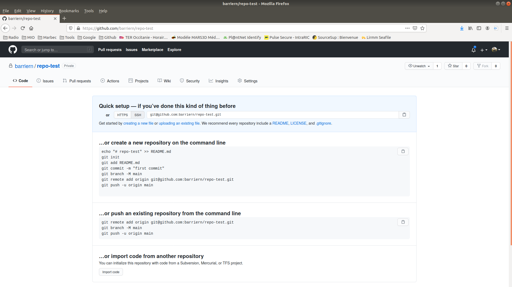

Github
=====================

# Introduction

## What is GitHub Inc.?

**GitHub** is a web-based hosting service for version control using **Git**.

- Access to the control and collaboration features for every
    **project**.

- Work with public and private **repositories**.

-   Develop a **networking**.

          
-   Source of information.

          
-   **Plans** for enterprise, teams, pro and free accounts.

-   Is the **largest** host of source code in the world! *(28 million
    users, 57 million repositories (28 million public) - June 2018)*.

    

- Allows to **host personal websites**

- Possibilities to use **continuous integration** using [GitHub Actions](https://docs.github.com/en/free-pro-team@latest/actions)

## Marbec in GitHub

All the materials of Pole Modelisation's technical \"workshop\" are now
stored in an institutionnal GitHub account: <https://github.com/umr-marbec>.

   

# First steps

## Register a GitHub account

-   Create an account in [GitHub](https://github.com/) is free!
-   There are some advantages for: 
    -   Students, faculty, and educational / research staff: [GitHub Education](https://education.github.com/).
    -   Official nonprofit organizations and charities: [GitHub for Good](https://github.com/nonprofit).

To create a GitHub account, click [here](https://github.com/join)

Tips about the name account:

-   Use your actual name (especially if you plan to host your website)!
-   Shorter is better than longer!
-   Be as unique as possible!
-   Re-use your name from other context

## How authenticating yourself with GitHub

There are two options of protocols for secure communication working over
a computer network!

### Hypertext Transfer Protocol Secure (HTTPS)

If you plan to work using HTTPS protocol, you can follow [Cache
credential for
HTTPS](https://happygitwithr.com/credential-caching.html#credential-caching)
for more information.

### SSH

If you plan to work using SSH protocol, you can follow [Set up keys
for SSH](https://happygitwithr.com/ssh-keys.html#ssh-keys) for more
information.

# Create a repository

To create a repository, click on the `Repositories` link of your profile and click on `New`. You should see the following:

  

Fill on the informations. If you create an empty repository, you should see the following:

  

