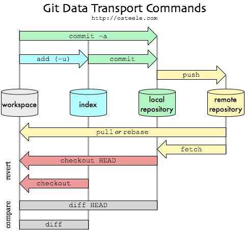

Introduction to GIT
===============================================

# What is Git?

**Git** is a distributed version control system for tracking changes in
source code during the development of software.

<div align=center>
    
</div>

# Why use Git?

-   **Popular and successful**
    -   Active development
    -   Fast
-   **Distributed**
    -   Work online and offline
    -   Collaborate with large groups
-   **Tracks any type of file**
    -   Works best with text
-   **Branching**
    -   Smarter merges
    
# Git is already installed?

To check that go to shell (terminal / command line / console) and enter
**which git** to request the path to your Git executable:

```
which git
```

Then enter **git --version** to see its version:

```
git --version
```

If git is not installed YET: See [Install git](https://happygitwithr.com/install-git.html) to follow the correct
steps to install git according your system

# Introduce yourself to Git

Let **git** to know about you, following this simple configuration
steps!

```
# Example
git config --global user.name "Criscely Lujan"
git config --global user.email "criscelylujan@gmail.com"
git config --global core.editor vim
git config --global --list
```

-   **user.name** can be your username. Your commits will be labelled
    with this name, so this should be informative!

-   **user.email** must be the email that you use to sign up for GitHub.

-   **core.editor** There are diverse options of [Git editor](http://swcarpentry.github.io/git-novice/02-setup/).

# Git clients

Git and Git client **are not** the same! Like R and RStudio is not the same thing! They are just tools that help you manipulate Git repositories:
-   IDE (Integrated development environment)!
-   Make the experience more pleasant providing a richer visual
    representation.

Some example of Git clients:

- [SourceTreen](https://www.sourcetreeapp.com/)
- [GitKraken](https://www.gitkraken.com/)
- [GitUp](https://gitup.co/)
- [SmartGit](https://www.syntevo.com/smartgit/)
- [git-cola](https://git-cola.github.io/)
- [RStudio](https://www.rstudio.com/)
- [TortoiseGit](https://tortoisegit.org/)
    
# Concepts

<div align="center">
 
</div>

As shown in the figure, a Git repository is made of:
- A **local workspace**, which is the content of your working directory.
- A **local repository**, which contains **locally** all the history of your files.
- A **remote repository**, which contains **remotely** all the history of your files.

# Git commands

Git commands allow to communicate among these three parts of the git repository. 

## From the remote repository

- `git clone` allows to download the **remote repository** into your **local one** and put the content into your **workspace**. This is the first thing to do.
- `git fetch` allows to update the **local repository** from the **local repository**
- `git checkout` updates the **workspace** from the **local repository**
- `git pull` does a `git fetch` and a `git clone`, therefore updates both the **local repo.** and the **workspace** from the **remote repository** 

## To the remote repository

If you have modified the files in your **workspace**:
- `git add` allows to select the files that will be sent to the **local** and eventually to the **remote** directory. These files are stored in an **index**. 
- `git commit` allows to send the files from the **index** to the **local repository**
- `git push` allows to send the files from the **local** to the remote **repository**

*Note: It is not necessary to work with a remote repository. You can only work locally.*

## Repository history

To have a brief history of the repository, type `git log`

## Find differences

To find what changes are in your workspace, type `git status`.

To have the difference between your workspace and your local repository (i.e. what is not yet in the `index`):

```
git diff
```

This can also be achieved using some specific `diff` editors (`vimdiff`, `tkdiff`) by using:

```
git difftool
```

To have a list of changes that are on `index`:

```
git diff --cached
```

To find differences between your current workspace and your last commit:

```
git diff HEAD
```

To find differences between the last commits of two branches:

```
git diff master..develop
```


## File removing and displacement

To keep file history, some specific commands need to be used:
- To move files (either rename or displace), use `git mv oldname newname`
- To remove files, use `git rm filename`.

When done, commit file:

```
git commit
git push
```

## Listing remote repositories

There are some commands that allow to manipulate/define remote repositories. 

To list all remote repositories:

```
git remote -vv
```

You should see something like this:

```
origin	git@github.com:osmose-model/osmose-private.git (fetch)
origin	git@github.com:osmose-model/osmose-private.git (push)
pub	git@github.com:osmose-model/osmose.git (fetch)
pub	git@github.com:osmose-model/osmose.git (push)
```

By default, all `push` and `pull` will be done on the `origin` remote. However, if you want to push or pull from another repository:

```
git pull git master
git push git master
```

**Warning: when pushing/pulling from another remote that *origin*, you need to specify the branch on the remote**

Complete list of commands related to remotes is shown below (outputs of `git remote -h`)

```
usage : git remote [-v | --verbose]
   ou : git remote add [-t <branche>] [-m <master>] [-f] [--tags | --no-tags] [--mirror=<fetch|push>] <nom> <url>
   ou : git remote rename <ancienne> <nouvelle>
   ou : git remote remove <nom>
   ou : git remote set-head <nom> (-a | --auto | -d | --delete | <branche>)
   ou : git remote [-v | --verbose] show [-n] <nom>
   ou : git remote prune [-n | --dry-run] <nom>
   ou : git remote [-v | --verbose] update [-p | --prune] [(<groupe> | <distante>)...]
   ou : git remote set-branches [--add] <nom> <branche>...
   ou : git remote get-url [--push] [--all] <nom>
   ou : git remote set-url [--push] <nom> <nouvelle-URL> [<ancienne-URL>]
   ou : git remote set-url --add <nom> <nouvelle-URL>
   ou : git remote set-url --delete <nom> <url>
```


<!--
### Git branches

One main advantage of Git is the use of *branches*, which allow multiple
developments of the same code at the same time.

Definition A branch in Git is simply a lightweight movable pointer to
one of thes commits.

<div align="center">
 
</div>

<div align="center">
 
</div>


In this example, the `master` branch points to the `f30ab` commit, while
the `testing` branch points to the `c2b9e` one. `HEAD` points to the
active branch (here, `testing`).

\vspace{1em}
Source: <https://git-scm.com/book/en/v1/Git-Branching-What-a-Branch-Is>

### Merging branches

To merge a branch (for instance a feature branch) to another branch (for
instance the main one), several options are offered.

- `merge`: Three-points branch (common ancestor + tips of the two
    branches)

- `rebase`: Compresses all the changes into a single "patch."

<div align="center">
 
</div>

<div align="center">
 
</div>

Source: <https://git-scm.com/book/fr/v1/Les-branches-avec-Git-Rebaser>


### Git workflows

There are several ways to use Git branches (we talk about
**workflows**).

-   *Centralized workflow*: one main branch, everyone commit in the same
    place.
-   *Feature Branch Workflow*: developments are made in dedicated
    branches (feature branches), which are regularly merged into the
    master one.

-   ***Gitflow Workflow***: Strict branching model designed around the
    project release.

Source: <https://www.atlassian.com/git/tutorials/comparing-workflows>

GitFlow branches

GitFlow workflow contains two main branches:

-   `master`: official release history. Branch which is shared to the
    world!

-   `develop`: integration branch for features

It also contains additional temporal branches:

-   `feature`: feature branches (one for each new feature to add to the
    code)

-   `release`: branch created when enough features have been added (new
    version of the code) to develop

-   `hotfix`: branch for maintenance and bug correction of the
    production release
-->
