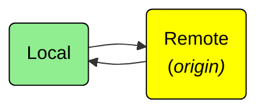

```mermaid
flowchart LR
    id1(Local)
    id2("Remote\n(<i>origin)")

    id1 --> id2
    id2 --> id1

    classDef workspace fill:lightgray,stroke:black,color:black
    classDef index fill:lightblue,stroke:black,color:black
    classDef local fill:lightgreen,stroke:black,color:black
    classDef remote fill:yellow,stroke:black,color:black
    class id1 local;
    class id2 remote;
```
