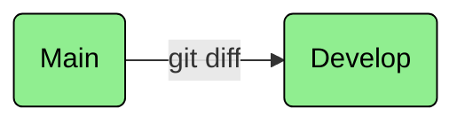
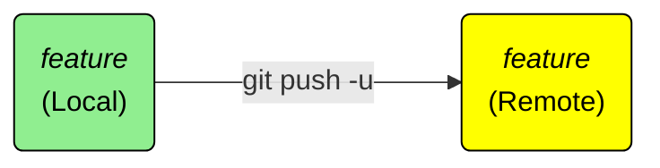
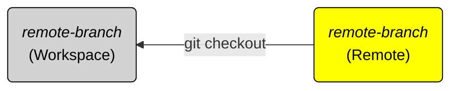

```mermaid
    flowchart LR
    id1(Main)
    id2(Develop)
    id1 -->|git diff| id2


classDef workspace fill:lightgray,stroke:black,color:black
classDef index fill:lightblue,stroke:black,color:black
classDef local fill:lightgreen,stroke:black,color:black
classDef remote fill:yellow,stroke:black,color:black

class id1,id2 local
```

```mermaid
    flowchart LR
    id1("<i>feature</i>\n(Local)")
    id2("<i>feature</i>\n(Remote)")
    id1 --->|git push -u| id2

classDef workspace fill:lightgray,stroke:black,color:black
classDef index fill:lightblue,stroke:black,color:black
classDef local fill:lightgreen,stroke:black,color:black
classDef remote fill:yellow,stroke:black,color:black

class id1 local
class id2 remote
```

```mermaid
    flowchart RL
    id1("<i>remote-branch</i>\n(Workspace)")
    id2("<i>remote-branch</i>\n(Remote)")
    id2 --->|git checkout| id1

classDef workspace fill:lightgray,stroke:black,color:black
classDef index fill:lightblue,stroke:black,color:black
classDef local fill:lightgreen,stroke:black,color:black
classDef remote fill:yellow,stroke:black,color:black

class id1 workspace
class id2 remote
```